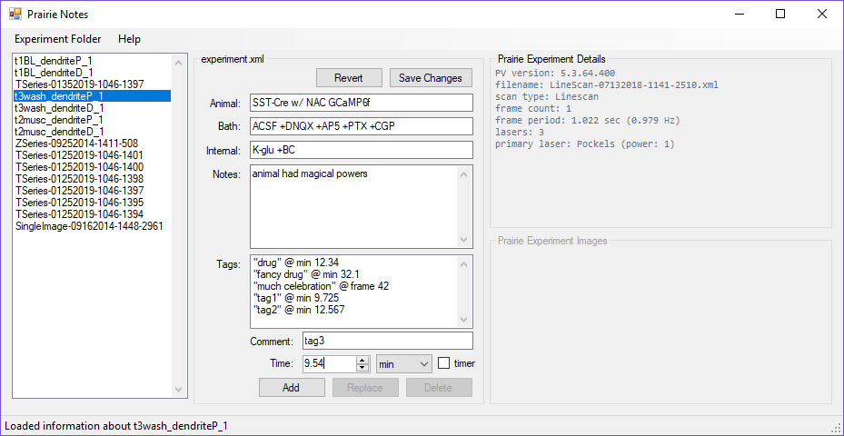

# PrairieViewer

**PrairieViewer** is a set of tools created to aid organization and documentation of data folders created by [Prairie View imaging software](https://loci.wisc.edu/sites/default/files/PrairieViewManual_5_2013_0.pdf).

#### Purpose
Prairie View software creates a new experiment folder for every experiment that is run. A typical day of experiments can result in hundreds of Prairie View folders. Within each folder, important imaging settings are buried in large XML files, and data (12-bit data encoded in 32-bit TIFs) cannot be easily viewed with standard tools. Important experimental information traditionally was written in text files manually edited in notepad. Tools provided in this repository seek to improve this workflow.

#### Adaptability
Although PrairieViewer was created with whole-cell patch-clamp electrophysiology in mind, the XML-parsing image-processing code is cleanly segregated into their own portable class libraries which may be easy to adapt for alternate applications.

## Prairie Notes

The **PrairieNotes** tool allows the experimenter to rapidly flip through PrairieView experiment folders, assess scan settings at a glance, and create their own notes (including time-tagged comments).

